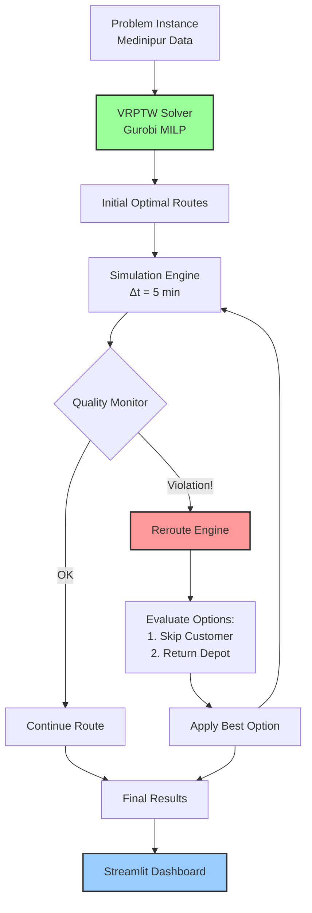

# Cold Chain Autonomous Rerouting 🚛❄️

**Real-time quality-driven vehicle rerouting for cold chain logistics using VRPTW optimization and multi-compartment temperature monitoring.**

[](LICENSE)
[](https://www.python.org/downloads/)
[](https://streamlit.io)
[](https://www.gurobi.com/)

---

## 🎯 Overview

A sophisticated cold chain logistics system designed for the **Medinipur District, West Bengal**, combining **Vehicle Routing Problem with Time Windows (VRPTW)** optimization with **autonomous real-time rerouting**. The system monitors multi-compartment temperature conditions (Frozen, Chilled, Fresh) and makes intelligent routing decisions to prevent quality degradation and minimize waste.

This project addresses the critical challenge of food loss in supply chains by dynamically adapting routes when simulated temperature excursions or delays occur.

### Key Features

- 🚚 **VRPTW Optimization** - Gurobi-powered initial route planning optimizing for distance, time, and spoilage risk.
- 🌡️ **Multi-Compartment Monitoring** - Real-time tracking of 3 distinct temperature zones:
    - **Zone A (3°C)**: Dairy products 🥛
    - **Zone B (12°C)**: Fruits & Vegetables 🍎
    - **Zone C (15°C)**: Flowers 💐
- 🔄 **Autonomous Rerouting Engine** - Intelligent decision-making during execution:
    - **Skip Customer**: Bypass low-priority stops to save jeopardized cargo.
    - **Return to Depot**: Emergency abort to save remaining load.
    - **Continue**: Proceed if risks are acceptable.
- 📊 **Interactive Dashboard** - Streamlit-based interface for:
    - Live animated route visualization on real geographic maps.
    - Real-time quality degradation graphs.
    - Comprehensive economic cost configuration.
- 🇮🇳 **Indian Context** - Real-world GPS data from Medinipur and economic parameters in INR (₹).

---

## 🏗️ System Architecture



---

## 🚀 Quick Start

### Prerequisites

- **Python 3.10+**
- **Gurobi Optimizer** (Requires a license - academic or commercial)
- **Virtual Environment** (Highly recommended)

### Installation

1.  **Clone the repository**
    ```bash
    git clone https://github.com/MaaSSim-Coevolution/Cold-chain-autonomous-rerouting.git
    cd Cold-chain-autonomous-rerouting
    ```

2.  **Create and activate virtual environment**
    ```bash
    # Windows
    python -m venv venv
    .\venv\Scripts\activate

    # Linux/Mac
    python3 -m venv venv
    source venv/bin/activate
    ```

3.  **Install dependencies**
    ```bash
    pip install -r requirements.txt
    ```

### Running the System

**Launch the Interactive Dashboard:**
```bash
streamlit run dashboard.py
```
*Alternatively:* `python run_demo.py --dashboard`

**Run Command-Line Simulation Only:**
```bash
python run_demo.py
```

---

## 📊 Dashboard Controls

The dashboard allows comprehensive control over the simulation parameters:

### ⚙️ Simulation Configuration
- **Fleet Size**: 2-5 vehicles
- **Capacity**: 10-30 units per vehicle
- **Quality Threshold**: Minimum acceptable quality % (default 60%)

### 💰 Economic Parameters (INR ₹)
- **Revenue**: Per customer delivery (₹500 - ₹2000)
- **Operating Costs**: Fuel (₹12/km), Driver (₹100/hr)
- **Penalties**: Spoilage cost (₹2700/unit), Temp violation cost

### ⚖️ Optimization Weights
- **Alpha (Distance)**: Cost per km
- **Beta (Time)**: Cost per minute
- **Gamma (Risk)**: Cost per unit of risk

---

## 👥 Contributors

| Role | Member | Contributions |
|------|--------|---------------|
| **Backend Lead** | 👨‍💻 **Raghuveer V** | • Core System Architecture<br>• VRPTW Solver (Gurobi)<br>• Simulation Engine & Rerouting Algorithms<br>• Synthetic Data Infrastructure |
| **Frontend Lead** | 👨‍💻 **Arnab Chakraborty** | • Streamlit Dashboard Design<br>• Real-world Geographic Research (Medinipur)<br>• Visualization & Analytics<br>• UX Design & Parameter Benchmarking |

---

## 🔮 Future Roadmap

We are actively working on the following enhancements:

### 1. 🌡️ Real-Time Temperature Data Integration
- Integration with IoT sensors (Arduino/ESP32).
- Live telemetry streaming via MQTT.
- Cloud database synchronization for real-time digital twin.

### 2. 🛡️ Model Robustness Enhancement
- Advanced edge case handling for complex routing scenarios.
- Validation against extensive real-world logistics datasets.

### 3. 📄 Documentation & Reporting
- comprehensive technical report and academic paper preparation.
- Detailed API documentation.

### 4. 🌐 Real-Time GUI Hosting
- Cloud deployment of the dashboard for public access.
- Multi-user support with persistent database.

---

## 📄 License

This project is licensed under the MIT License - see the [LICENSE](LICENSE) file for details.

## 🙏 Acknowledgments

- **Gurobi Optimization** for the powerful MILP solver.
- **Streamlit** for the amazing rapid application development framework.
- **Plotly** for interactive map visualizations.
