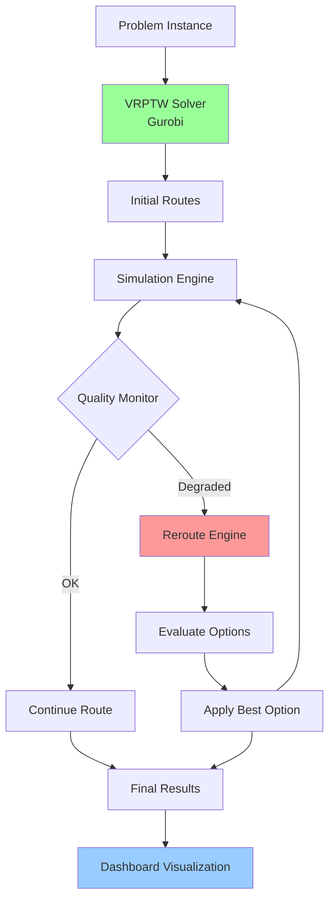

# Cold Chain Autonomous Rerouting

**Real-time quality-driven vehicle rerouting for cold chain logistics using VRPTW optimization and multi-compartment temperature monitoring**

[](https://opensource.org/licenses/MIT)
[](https://www.python.org/downloads/)
[](https://streamlit.io)

---

## 🎯 Overview

A sophisticated cold chain logistics system that combines **Vehicle Routing Problem with Time Windows (VRPTW)** optimization with **autonomous real-time rerouting** to preserve product quality and minimize waste. The system monitors multi-compartment temperature conditions and makes intelligent routing decisions to prevent quality degradation.

### Key Features

- 🚚 **VRPTW Optimization** - Gurobi-powered route planning with time windows, capacity constraints, and risk minimization
- 🌡️ **Multi-Compartment Monitoring** - Track temperature and quality for different product types (dairy, produce, flowers)
- 🔄 **Autonomous Rerouting** - Real-time quality-preserving decisions (skip customers, return to depot, expedite delivery)
- 📊 **Interactive Dashboard** - Live route visualization, quality graphs, and performance metrics
- ⚡ **Time-Stepped Simulation** - Realistic modeling of temperature dynamics, delays, and reefer glitches

---

## 🏗️ System Architecture



---

## 🚀 Quick Start

### Prerequisites

- Python 3.10+
- Gurobi Optimizer (with valid license)
- Virtual environment (recommended)

### Installation

```bash
# Clone the repository
git clone https://github.com/YOUR_USERNAME/cold-chain-autonomous-rerouting.git
cd cold-chain-autonomous-rerouting

# Create virtual environment
python -m venv venv
source venv/bin/activate  # On Windows: .\venv\Scripts\activate

# Install dependencies
pip install -r requirements.txt
```

### Running the Simulation

```bash
# Run with default scenario
python run_demo.py

# Run with interactive dashboard
python run_demo.py --dashboard

# Or launch dashboard directly
streamlit run dashboard.py
```

---

## 📊 Dashboard Features

The interactive Streamlit dashboard provides comprehensive monitoring and analysis:

### Real-Time Monitoring
1. **🗺️ Route Visualization** - Geographic map showing vehicle routes on India map (Medinipur district)
   - Color-coded routes per vehicle
   - Customer locations with city names
   - Hub/depot marked with star icon
   - Plotly Scattergeo for reliable rendering

2. **📈 Quality Degradation Tracking** - Per-vehicle and per-batch quality over time
   - Exponential decay visualization
   - Quality threshold indicators
   - Product-specific degradation curves

3. **🌡️ Temperature Monitoring** - Multi-compartment temperature profiles
   - Independent compartments (A: Dairy 3°C, B: Produce 12°C, C: Flowers 15°C)
   - Safe range visualization
   - Temperature excursion alerts

### Decision Intelligence

4. **🔄 Autonomous Reroute Timeline** - Complete decision history
   - Trigger events (temperature excursion, cumulative abuse, quality drop)
   - Options evaluated with scores
   - Final decision with economic impact

5. **📊 Performance Metrics Dashboard**
   - Fulfillment rate (customers served/total)
   - Average delivered quality
   - Total distance traveled
   - Economic summary (revenue, costs, profit)

### Analytics & Insights

6. **📉 Customer Fulfillment Status**
   - Delivered vs. abandoned customers
   - Quality at delivery with color coding (🟢 Good, 🟡 Acceptable, 🔴 Poor)
   - Reason for abandonment (quality preservation)

7. **🚚 Vehicle Summary Cards**
   - Final temperatures per compartment
   - Reroute triggers activated
   - Batches tracked
   - Total above-safe time
   - Cumulative abuse score

8. **⚙️ Interactive Configuration**
   - Adjustable simulation parameters in sidebar
   - Number of customers (5-20)
   - Fleet size (2-5 vehicles)
   - Vehicle capacity (10-30 units)
   - Quality threshold (40-90%)
   - Economic parameters (₹ revenue, spoilage costs)

---

## 🧠 How It Works

### 1. Route Planning (VRPTW)

The system uses Gurobi to solve a multi-objective VRPTW:

```python
minimize: α·distance + β·time + γ·risk
subject to:
  - Time window constraints
  - Vehicle capacity limits
  - Flow conservation
  - Subtour elimination
```

### 2. Quality Monitoring

Each batch is tracked with:
- **Above-safe time** - Minutes exceeding safe temperature range
- **Cumulative abuse** - Weighted temperature violations
- **Quality estimate** - Exponential decay based on exposure

Triggers for rerouting:
- Quality below threshold (60% default)
- Cumulative abuse exceeds limit
- Temperature out of safe range

### 3. Autonomous Rerouting

When quality degradation is detected, the system evaluates:

| Option | Description | When Used |
|--------|-------------|-----------|
| **Skip Customer** | Bypass low-priority customer | Save time, ≤2 customers lost |
| **Return to Depot** | Abandon remaining stops | Emergency, ≤3 customers lost |
| **Expedite Delivery** | Increase speed (not implemented yet) | Minor delays |

Decision scoring:
```python
score = preserved_revenue - (lost_customers × avg_revenue) + (quality_gain × 1000)
```

---

## 📁 Project Structure

```
cold_chain_monitoring/
├── config.py                 # Simulation configuration
├── data_models.py            # Data structures (Node, Vehicle, Shipment, etc.)
├── synthetic_data.py         # Problem instance generator
├── vrptw_solver.py           # Gurobi VRPTW implementation
├── sim_engine.py             # Time-stepped simulation
├── temperature_model.py      # Thermal dynamics
├── monitoring.py             # Quality tracking
├── reroute_engine.py         # Autonomous decision-making
├── dashboard.py              # Streamlit visualization
├── run_demo.py               # Main entry point
├── requirements.txt          # Python dependencies
└── README.md                 # This file
```

---

## 🎓 Technical Details

### Temperature Model

Multi-compartment reefer units with:
- Independent setpoints per compartment (dairy: 3°C, produce: 12°C, flowers: 15°C)
- Leakage factor (heat ingress from ambient)
- Cooling power with stochastic variation
- Random glitch events (reefer failure)

### Quality Decay

Exponential decay model:
```python
quality(t) = exp(-k × cumulative_abuse)
where:
  k = product-specific decay constant
  cumulative_abuse = Σ(max(0, temp - safe_max) × dt)
```

### Routing Constraints

- **Time Windows**: Hard constraints on service start times
- **Capacity**: Multi-dimensional (by product type)
- **Service Time**: Loading/unloading delays
- **Travel Time**: Distance-based with speed factors

---

## 📈 Results & Performance

Typical simulation results:
- **Fulfillment Rate**: 60-85% (with quality-preserving rerouting)
- **Average Quality**: 70-80% at delivery
- **Reroute Decisions**: 1-3 per simulation
- **Computation Time**: <5 seconds for 12 customers

---

## 🛠️ Configuration

### Scenario Files (Coming Soon)

Load custom scenarios from JSON:

```json
{
  "n_customers": 15,
  "n_vehicles": 3,
  "vehicle_capacity": 20,
  "trigger_min_quality": 0.65,
  "horizon_min": 240,
  "seed": 42
}
```

---

## 👥 Team Contributions

### 👨‍💻 Raghuveer V - Backend Development Lead

**Core System Architecture**
- VRPTW solver implementation (Gurobi)
- Simulation engine development
- Autonomous rerouting algorithms

**Data Infrastructure**
- Synthetic data generator
- Real geography integration (Medinipur)
- Output management system

**Version Control & Integration**
- GitHub repository setup
- Code documentation
- CI/CD pipeline configuration

**Performance Optimization**
- Algorithm efficiency tuning
- Multi-compartment temperature dynamics
- Quality tracking models

---

### 👨‍💻 Arnab Chakraborty - Frontend & Research Lead

**User Interface Development**
- Streamlit dashboard design
- Interactive route visualization
- Real-time metrics display

**Visualization & Analytics**
- Animated map integration (Plotly)
- Quality degradation graphs
- Temperature monitoring charts

**Data Research & Validation**
- Real-world GPS coordinates collection
- Indian cold chain logistics research
- Economic parameter benchmarking

**User Experience Design**
- Dashboard parameter controls
- Cost configuration interface
- Customer demand inputs

---

## 🚀 Future Work & Roadmap

### 🌡️ Real-Time Temperature Data Integration
**Priority: HIGH**
- IoT sensor integration (Arduino/ESP32)
- Live telemetry streaming via MQTT
- Real-time anomaly detection
- Cloud database synchronization

### 🔧 Model Robustness Enhancement
**Priority: HIGH**
- Edge case handling
- Validation with real logistics data

### 📄 Project Report & Documentation
**Priority: MEDIUM**
- Technical report writing
- Algorithm documentation
- User manual creation
- Academic paper preparation

### 🌐 Real-Time GUI Hosting
**Priority: MEDIUM**
- Cloud deployment (AWS/Azure/Heroku)
- Persistent database setup
- Multi-user authentication
- Public web access configuration

---

## 📄 License

This project is licensed under the MIT License - see the [LICENSE](LICENSE) file for details.

---

## 🙏 Acknowledgments

- Gurobi Optimization for VRPTW solver
- Streamlit for interactive dashboard framework
- Plotly for visualization
- MaaSSim project inspiration

---

## 📧 Contact

For questions or collaboration opportunities:
- 📧 Email: [your.email@example.com]
- 🐛 Issues: [GitHub Issues](https://github.com/YOUR_USERNAME/cold-chain-autonomous-rerouting/issues)

---

## 📊 Citation

If you use this project in your research, please cite:

```bibtex
@software{cold_chain_routing_2026,
  author = {Raghuveer V and Arnab Chakraborty},
  title = {Cold Chain Autonomous Rerouting: Quality-Driven Vehicle Routing for Perishable Logistics},
  year = {2026},
  url = {https://github.com/YOUR_USERNAME/cold-chain-autonomous-rerouting}
}
```

---

**⭐ Star this repo if you find it useful!**
